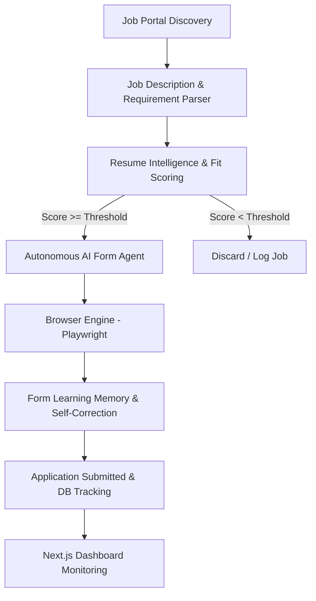

# 🤖 Autonomous AI Job Application & Portal Discovery Agent (v2)

[](https://www.python.org/)
[](https://nextjs.org/)
[](https://playwright.dev/)
[](https://fastapi.tiangolo.com/)
[](https://opensource.org/licenses/MIT)

An autonomous multi-agent pipeline designed to automate job portal discovery, evaluate candidate-job fit using LLM-driven resume intelligence, interact with application forms via browser automation, and track real-time application lifecycles.

---

## 🌟 Key Features

- **Multi-Agent Orchestration Pipeline:** Coordinates specialized agents for job discovery, requirement extraction, relevance scoring, and form execution.
- **Autonomous Browser Engine:** Powered by Playwright with stealth configurations to navigate complex dynamic portals, multi-step job boards, and applicant tracking systems (ATS).
- **Resume Intelligence & Scoring:** Computes semantic relevance and skill match percentages against target job descriptions before triggering submissions.
- **Form Learning Memory:** Remembers questions, past responses, and company-specific application patterns to improve fill accuracy over time.
- **Live Monitoring Dashboard:** Modern Next.js interface providing live application logs, run controls, success/failure metrics, and pipeline configuration.

---

## 🏗️ Architecture Overview



---

## 📁 Project Structure

```text
ai-job-agent-v2/
├── app/
│   ├── db/                    # Database models, schemas & migrations
│   ├── services/
│   │   ├── ai_form_agent.py   # Form filling logic & element interaction
│   │   ├── browser_engine.py  # Playwright browser instance manager
│   │   └── form_learning_memory.py # Historical answer retrieval & cache
│   └── worker/
│       ├── automation_manager.py
│       └── multi_agent_pipeline.py # Orchestrator loop
├── frontend/                  # Next.js dashboard UI
│   ├── app/
│   │   ├── (dashboard)/automation/page.tsx
│   │   └── layout.tsx
│   └── package.json
├── tests/                     # Unit, integration & live portal tests
├── requirements.txt
└── README.md
```

---

## 🚀 Quickstart

### Prerequisites

- Python 3.10+
- Node.js 18+
- Chromium / Playwright binaries

### Backend & Agents Setup

```bash
# 1. Create and activate virtual environment
python3 -m venv venv
source venv/bin/activate

# 2. Install dependencies
pip install -r requirements.txt
playwright install chromium

# 3. Configure environment variables (.env)
cp .env.example .env

# 4. Run the worker pipeline
python -m app.worker.automation_manager
```

### Dashboard UI Setup

```bash
cd frontend
npm install
npm run dev
```

Visit `http://localhost:3000` to view the live agent dashboard.

---

## 🛠️ Tech Stack

- **Agent Engine & Automation:** Python, Playwright, BeautifulSoup4, AsyncIO
- **AI & NLP:** LLM Prompting, Sentence-Transformers, Semantic Matchers
- **Frontend Dashboard:** Next.js 14, React, TailwindCSS, TypeScript
- **Database:** SQLite / PostgreSQL, SQLAlchemy, Alembic

---

## 👤 Author

**Sivanesan B**  
- Portfolio: [sivanesanbalu.netlify.app](https://sivanesanbalu.netlify.app)  
- LinkedIn: [linkedin.com/in/sivanesan-b-871ba7264](https://www.linkedin.com/in/sivanesan-b-871ba7264/)  
- Email: apsiva69@gmail.com
